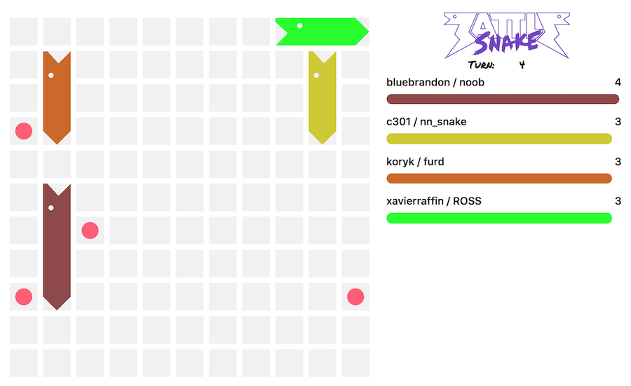

# Step 1 - Deploy a Snake

This section will deploy a pre-trained AI into your AWS account. This AI will expose the [Battlesnake API](https://docs.battlesnake.com/snake-api).

## Architecture

The deployed architecture will consist of the following components:

> __Estimated cost__ : By default, the project will use a ml.t2.medium because newly created account can launch only this instance type. This instance cost $1.56 a day. If you have an account that exist for some time (typically more than a week) then you should be able to select ml.m5.xlarge instance which is included within the [AWS Free tiers](https://aws.amazon.com/free/). The AWS Free tiers can support 500,000 snake API invocations over a 125 hour period per month for the first two months. The free tiers also include 250 hours per month of this notebook instance for the first two months.
> After the free tiers are exceeded, the charges will be approximately $6.5 per 24 hour period for m5 (and only $1.56 a day for t2 ) for the endpoint instance, $0.0582 per hour for the notebook instance, and $6 per million Snake API calls.
> __Cost savings tip__ : Once you have finished working (ex: participating in games) you can stop your SageMaker notebook instance in order to stop consuming free tiers or incurring charges. You can easily restart these components at a later date in order to continue your work. You can also delete the SageMaker Inference Endpoint and recreate it when needed (manually or using the _Deploy the SageMaker endpoint_ section of the heuristic dev notebook from [Step 2](UpdateHeuristicsAndDeploy.md)).
> See pricing details: [Amazon Sagemaker pricing](https://aws.amazon.com/sagemaker/pricing/), [AWS Lambda pricing](https://aws.amazon.com/lambda/pricing/), [Amazon API Gateway pricing](https://aws.amazon.com/api-gateway/pricing/)

## Deploy environment

Use the links below to deploy the project into your preferred region\*:

| Region        | deployment link |
| ------------- | :-------------:|
| __US West (Oregon) (us-west-2)__**      | [deploy](https://us-west-2.console.aws.amazon.com/cloudformation/home?region=us-west-2#/stacks/create/review?templateURL=https://battlesnake-aws-us-west-2.s3.us-west-2.amazonaws.com/cloudformation/deploy-battlesnake-endpoint.yaml&stackName=BattlesnakeEnvironment) |
| US East (N. Virginia) us-east-1     | [deploy](https://us-east-1.console.aws.amazon.com/cloudformation/home?region=us-east-1#/stacks/create/review?templateURL=https://battlesnake-aws-us-east-1.s3.us-east-1.amazonaws.com/cloudformation/deploy-battlesnake-endpoint.yaml&stackName=BattlesnakeEnvironment) |
| Canada (Central) ca-central-1     | [deploy](https://ca-central-1.console.aws.amazon.com/cloudformation/home?region=ca-central-1#/stacks/create/review?templateURL=https://battlesnake-aws-ca-central-1.s3.ca-central-1.amazonaws.com/cloudformation/deploy-battlesnake-endpoint.yaml&stackName=BattlesnakeEnvironment) |
| South America (São Paulo) sa-east-1     | [deploy](https://sa-east-1.console.aws.amazon.com/cloudformation/home?region=sa-east-1#/stacks/create/review?templateURL=https://battlesnake-aws-sa-east-1.s3.sa-east-1.amazonaws.com/cloudformation/deploy-battlesnake-endpoint.yaml&stackName=BattlesnakeEnvironment) |
| Europe (Ireland) eu-west-1     | [deploy](https://eu-west-1.console.aws.amazon.com/cloudformation/home?region=eu-west-1#/stacks/create/review?templateURL=https://battlesnake-aws-eu-west-1.s3.eu-west-1.amazonaws.com/cloudformation/deploy-battlesnake-endpoint.yaml&stackName=BattlesnakeEnvironment) |
| Europe (Paris) eu-west-3     | [deploy](https://eu-west-3.console.aws.amazon.com/cloudformation/home?region=eu-west-3#/stacks/create/review?templateURL=https://battlesnake-aws-eu-west-3.s3.eu-west-3.amazonaws.com/cloudformation/deploy-battlesnake-endpoint.yaml&stackName=BattlesnakeEnvironment) |
| Asia Pacific (Sydney) ap-southeast-2    | [deploy](https://ap-southeast-2.console.aws.amazon.com/cloudformation/home?region=ap-southeast-2#/stacks/create/review?templateURL=https://battlesnake-aws-ap-southeast-2.s3.ap-southeast-2.amazonaws.com/cloudformation/deploy-battlesnake-endpoint.yaml&stackName=BattlesnakeEnvironment) |

_Note: Before deploying the environment, you need to be logged into the AWS account where you want to deploy the CloudFormation stack._

_\*The official Battlesnake platform runs in us-west-2. Selecting this region will provide you with the lowest latency_

On the stack creation page you can optionnaly:
 * customize your snake's appearance (color, head, tail)
 * change the instance type for training and inference
 * select the training method: MXNet or RLLib (faster)

Once done scroll down at the end of the page.
Then check all permissions:

Click "Create Stack"

After about 10 minutes, the stack status should be CREATE_COMPLETE:

Open the outputs tab and click on the "CheckSnakeStatus" link to see if the Snake is ready.

Initially, you should see that the snake is being created:

After about 10 minutes you should see something like this:

> __Troubleshooting__ : If after 20 minutes the snake is not ready, you can choose 'Amazon Sagemaker' within the AWS console and look for 'Inference Endpoints'. If you don't see any inference endpoints, go to your SageMaker notebook instance, click on your instance, scroll down and click on 'View Logs'. Then click on BattlesnakeNotebook/LifecycleConfigOnStart and see if you find any error.

> If the error is _The account-level service limit 'ml.m5.xlarge for endpoint usage' is 0 Instances_ then delete the stack, and recreate it selecting a different instance type on the AWS CloudFormation stack parameter page.

Again on Outputs tab, the value "Snake URL" is your Snake URL. This is the URL that you can use to specify your snake on [Battlesnake](https://play.battlesnake.com/) !

Add your snake on the [Battlesnake platform](https://play.battlesnake.com/) and copy your URL:

Create a new game, select your snake by its name, add opponents, and then start the game:

## Stop instances

Once you finish your work for the day or you finish participating in games with your snake, you can stop your instances:

* To stop the notebook instance (dev environment) go to Amazon Sagemaker in the AWS console, navigate to 'notebook instances', select your instance, click action, and choose stop.
* To stop the endpoint instance (dev environment) go to Amazon Sagemaker in the AWS console, navigate to 'inference endpoints', select your endpoint, click action, and choose stop.

## Next step: customize snake

Go to __[Step 2](UpdateHeuristicsAndDeploy.md)__ to start making changes to the snake's behavior.

## Clean up environment

To clean up the environment, go to AWS CloudFormation within the AWS console, select your BattlesnakeEnvironment stack, and click 'delete'.

__WARNING : Deleting your stack will erase the Battlesnake environment data, and any code changes.__ Make sure that you have saved your work before doing this! One way to do that is to [setup source control](SetupSourceControl.md)
