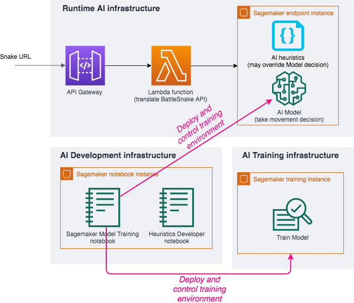
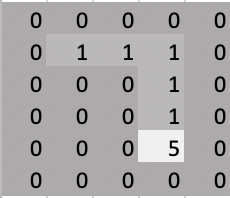
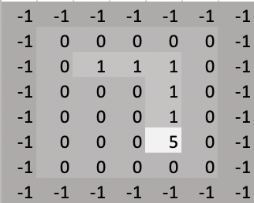

# STEP 3 - Train the AI model with your own settings

This page explains how to retrain the model, and how to modify the training settings.

This is controlled mainly by a single notebook and will use a training gym environment.

> __PRE-REQUISITE__: You need to run __[STEP 1 - Deploy the environment](DeployTheAIEndpoint.md)__ before following these instructions.

## Architecture

This step adds a training instance to the Battlesnake environment:

## Cost

> __Estimated cost__ : This environment adds a training instance to the [STEP 1 base environment](DeployTheAIEndpoint.md): the free tiers include 50 hours per month for the training instance during the first two months.
> After the free tiers are exceeded, the charge will be $0.269 per hour ($6.5 per 24 hour period) when the training instance is running.
> __Cost savings tip__ : Once you have finished training, you can stop your training instance in order to stop consuming free tiers or incurring charges. You can easily restart them at a later date to continue with training.

## Setting up on Amazon SageMaker

Similar to accessing the heuristics developer environment, check the CloudFormation 'Outputs' tab and open _ModelTrainingEnvironment_:

> _You need to be authenticated for that link to work. Click on __SourceEditionInNotebook__ link if you are denied access_

- Once you have opened the SagemakerModelTraining.ipynb notebook, run through the notebook in order to train the model or run hyperparameter optimization (Press ► on the top to run the notebook). See [here](https://www.youtube.com/watch?v=7wfPqAyYADY) for a tutorial on how to use Jupyter Notebooks.
- set `run_hpo = False` to train your model, or `run_hpo = True` to run hyperparameter optimization.

> __Dev tools:__ Editing code in Jupyter with no source version control is convenient for test but won't work for big projects. If you want to go further follow the [setup source control](SetupSourceControl.md)

## Training a reinforcement learning model

The reinforcement learning components of this project include an OpenAI gym to train your Battlesnake AI (https://play.battlesnake.com/) and an MXNet example notebook to train your own neural network.

The OpenAI gym was designed to follow the official Battlesnake rules outlined here: https://docs.battlesnake.com/rules.

### Training the MXNet example on Amazon SageMaker

From the Cloudformation stack created during [STEP 1](DeployTheAIEndpoint.md), go to the  'Outputs' tab and click on the link next to _ModelTrainingEnvironment_:

The notebook contains code for training, hyperparameter optimisation, and automatic deployment of the model.

Press ► on the top to run the notebook (see [here](https://www.youtube.com/watch?v=7wfPqAyYADY) for a tutorial on how to use jupyter notebooks).

The main entry point (Amazon SageMaker endpoint) of the training the model is [`examples/train.py`](../TrainingEnvironment/examples/train.py)

### Reinforcement learning and gym details

#### Observation space: 

This gym provide several options for the the observation space. 
The observation space provided by the gym is of size `N x M x C` where `N` and `M` are the width and height of the map and `C` is the number of snakes (+1 to account for the food). The food is indicated by values of `1` in `C=0`. The snakes are stored in `C=1 to C=num_snakes+1` and can be represented in [2 possible ways](../TrainingEnvironment/battlesnake_gym/snake_gym.py) (`51s`, `num`): 

*Figure 1: 51s snake representation*             |  *Figure 2: num snake representation*
:-----------------------------------------------:|:----------------------------------------------------------------:
 |  

The gym also provides an option to increase the map size by 2 to include -1 in the border.

*Figure 3: bordered 51s snake representation*

#### Actions:

For each snake, the possible [actions](../TrainingEnvironment/battlesnake_gym/snake.py) are UP, DOWN, LEFT, RIGHT (0, 1, 2, 3 respectively). Please note that according to the rules of Battlesnake, if your snake is facing UP and your snake performs a DOWN action, your snake will die.

#### Food spawning:

The food spawning algorithm is not provided in the official Battlesnake rules. The gym uses a food spawning mechanism based on the code provided [here](
https://github.com/battlesnakeio/engine/blob/master/rules/tick.go#L82)

#### Rewards

Designing an appropriate reward function is an important aspect of reinforcement learning. Currently, the gym records the following events that can be used to help shape your reward function:
1. Surviving another turn (labelled as: `"another_turn"`)
3. Eating food (labelled as: `"ate_food"`)
4. Winning the game (labelled as: `"won"`)
5. Losing the game (labelled as: `"died"`)
6. Eating another snake (labelled as: `"ate_another_snake"`)
7. Dying by hitting a wall (labelled as: `"hit_wall"`)
8. Hitting another snake (labelled as: `"hit_other_snake"`)
9. Hitting yourself (labelled as: `"hit_self"`)
10. Was eaten by another snake (labelled as: `"was_eaten"`)
11. Another snake hits your body (labelled as: `"other_snake_hit_body"`)
12. Performing a forbidden move (i.e., moving south when facing north) (labelled as: `"forbidden_move"`)
13. Dying by starving (labelled as: `"starved"`)

The current reward function is simple (`"another_turn"=1, "won"=2, "died"=-3, "forbidden_move"=-1`).
More complex reward functions with methods that can handle sparse rewards may be greatly beneficial. Also, it is possible to design different rewards for different snakes. 

### Interacting with the gym

Based on the OpenAI gym framework, the following functions are used to interact with the gym:

1. >`state, _, dones, info = env.reset()`

This function resets the environment. This is called when first creating the environment, and also at the end of each episode. 'state' provides the initial observations. 'info' provides information on the turn count and the health of each snake

2. > `state, rewards, dones, info = env.step(actions)`

This function executes one time step within the environment, based on the set of snake actions contained in `actions`

`actions` should be a numpy array of size `num_snakes` containing integers 0 to 3, to represent the desired action for each snake in the environment

`rewards` is a dictionary of reward values, keyed by the snake id. For example {'0': 45, '1': 37, '2': 60}

`dones` is a dictionary of booleans indicating if each snake has died. Like rewards, the dictionary is keyed by snake ID, beginning at 0. 

3. > env.render(mode="rgb_array")

This function renders the environment based on its current state.

`mode` can be `rbg_array`, `ascii`, `human` 
- `rbg_array` outputs an expanded numpy array that can be used for creating gifs
- `ascii` outputs a text based representation that can be printed in the command prompt
- `human` an OpenAI plot will be generated

### The DQN Network

#### Running DQN example

`python examples/train.py --should_render --print_progress --number_of_snakes 4`

*Please refer to https://github.com/awslabs/sagemaker-battlesnake-ai/blob/master/TrainingEnvironment/examples/train.py for the other hyperparameters*

This code uses multi-agent DQN to train the bots. The `N` snakes share the same Qnetwork and the network is configured as follows:

*Figure 4: The qnetwork*

Given a state representation `N x M x C` to get the action of snake `i`, the network expects that `C=1` is the representation of snake `i` and `C=2 ... num_snakes+1` are the remaining snakes (note that `C=0` represents the food).

The inputs 'snake health' and 'snake ID' in the figure correspond to the health and ID of Snake `i`.

### Testing the environment

Render env:
`BATTLESNAKE_RENDER=1 python -m unittest test.test_battlesnake_gym`

Without env rendering:
`BATTLESNAKE_RENDER=0 python -m unittest test.test_battlesnake_gym`

Performance tests:
`python -m test.measure_performance`
