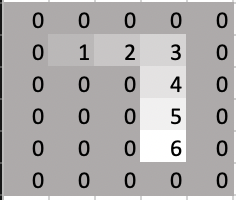
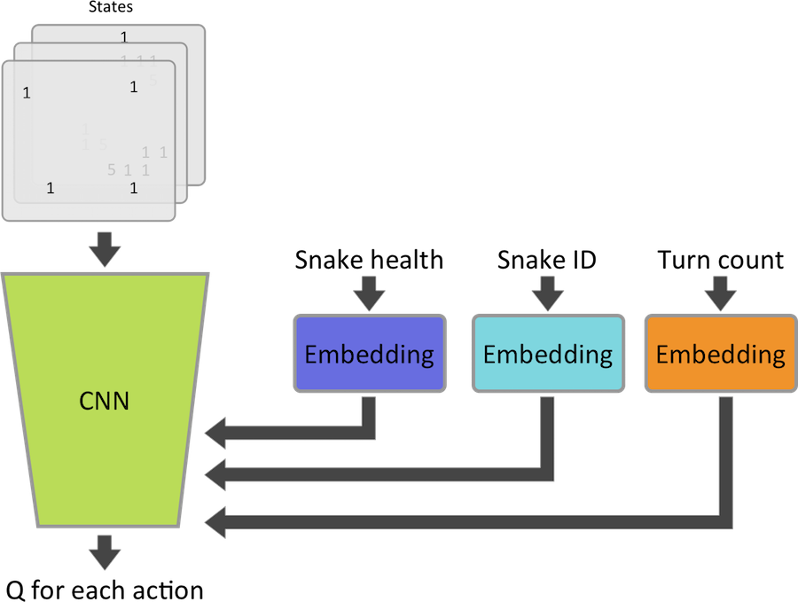

# STEP 3 - Train the AI model with your own settings

This page explain how to train the model again and how to modify the training settings.

This is controlled mainly by a single notebook and will use an training gym environment.

> __PRE-REQUISITE__: You need to run __[STEP 1 - Deploy the environment](DeployTheAIEndpoint.md)__ before following this instructions.

## Architecture

This step add a training instance to the BattleSnake environment:

## Cost

> __Estimated cost__ : This environment add a training instance to [STEP 1 base environment](DeployTheAIEndpoint.md): the free tiers include 50 hours per month for training instance on the first two months.
> After the free tiers the charge will be $0.269 per hour ($6.5 per 24 hour period) when the training instance is started.
> __Saving tip__ : Once you have finished training you can stop your training instance to stop consuming free tiers or occuring charge. You can restart them later to continue training.

## Dependencies
- gym: `pip install gym`

- array2gif: `pip install array2gif`

- mxnet (to run reinforcement learning algorithm): For installation see: https://mxnet.apache.org/get_started

## Setting up on sagemaker

Similar to the heuritsics developer, check the output tab and open ModelTrainingEnvironment: 

- Once in SagemakerModelTraining.ipynb, run through the notebook to train or run hyperparameter optimization (Press ► on the top to run the notebook (see here for a tutorial on how to use jupyter notebooks).
- set `run_hpo = False` to train and `run_hpo = True` to run hyperparameter optimization.

## Training a reinforcement learning model

The reinforcement learning component provides an openAI gym to train your battlesnake bots (https://play.battlesnake.com/) and an mxnet example train your own network.

The openAI gym was designed to follow the rules as provided here: https://docs.battlesnake.com/rules.

### Training the MXNet example on Amazon SageMaker

From the Cloudformation stack created at [STEP 1](DeployTheAIEndpoint.md) go on outputs tab and click on the link next to _ModelTrainingEnvironment_:

The notebook contains code on training, hyper parameter optimisation, and automatic deployment of the model.

Press ► on the top to run the notebook (see [here](https://www.youtube.com/watch?v=7wfPqAyYADY) for a tutorial on how to use jupyter notebooks).

The main entry point (Amazon SageMaker endpoint) of the training the model is [`examples/train.py`](../TrainingEnvironment/examples/train.py)

### Reinforcement learning and gym details
#### Observation space: 
This gym provide several options for the options for the observation space. 
The observation space provided by the gym is of size `N x M x C` where `N` and `M` are the width and height of the map and `C` is the number of snakes + 1 to account for the food). The food is indicated by values of `1` in `C=0`. The snakes in `C=1 to C=num_snakes+1` and represented by 2 [options](../TrainingEnvironment/battlesnake_gym/snake_gym.py) (`51s`, `num`): 

*Figure 1: 51s snake representation*             |  *Figure 2: num snake representation*
:-----------------------------------------------:|:----------------------------------------------------------------:
 |  

The gym also provides an option to increase the map size by 2 to include -1 in the border.

*Figure 3: bordered 51s snake representation*

#### Actions:
For each snake, the possible [actions](../TrainingEnvironment/battlesnake_gym/snake.py) are UP, DOWN, LEFT, RIGHT (0, 1, 2, 3 respectively). Please note that according to the rules of Battsnake, if your snake is facing UP and your snake performs a DOWN action, your snake will die.

#### Food spawning:
The food spawning were not provided in the official battlesnake rules. The gym was designed based on the code provided [here](
https://github.com/battlesnakeio/engine/blob/master/rules/tick.go#L82)

#### Rewards
Designing the reward function could an avenue of exploration. Currently the gym records the following events: 
1. Surviving another turn (labelled as: `"another_turn"`)
3. Eating food (labelled as: `"ate_food"`)
4. Winning the game (labelled as: `"won"`)
5. Losing the game (labelled as: `"died"`)
6. Eating another snake (labelled as: `"ate_another_snake"`)
7. Dying by hitting a wall (labelled as: `"hit_wall"`)
8. Hitting another snake (labelled as: `"hit_other_snake"`)
9. Hitting yourself (labelled as: `"hit_self"`)
10. Was eaten by another snake (labelled as: `"was_eaten"`)
11. Another snake hits your body (labelled as: `"other_snake_hit_body"`)
12. Performing a forbidden move (i.e., moving south when facing north) (labelled as: `"forbidden_move"`)
13. Dying by starving (labelled as: `"starved"`)

The current reward function is simple (`"another_turn"=1, "won"=2, "died"=-3, "forbidden_move"=-1`).
More complex reward functions with methods that could handle sparse rewards may be greatly beneficial. Also, it is possible to design different rewards for different snakes. 

### Interacting with the gym
Based on the openAI gym framework, the following functions are used to interact with the gym:

1. >`state, _, dones, info = env.reset()`

info provides information on the turn count and the health of each snake

2. > `env.step(actions)`

`actions` expects an numpy array of size `num_snakes` containing integers 0 to 3.

3. > env.render(mode="rgb_array")

`mode` can be `rbg_array`, `ascii`, `human` 
- `rbg_array` outputs an expanded numpy array that can be used for creating gifs
- `ascii` outputs a text based representation that can be printed in the command prompt
- `human` an openAI plot will be generated

### The DQN Network
#### Running DQN example
`python examples/train.py --should_render --print_progress --number_of_snakes 4`
*please refer to https://github.com/awslab/sagemaker-battlesnake-ai/TrainingEnvironment/examples/train.py for the other hyperparameters*

This code uses multi-agent DQN to train the bots. The `N` snakes shared the same qnetwork and the network was configured as follows:

*Figure 4: The qnetwork*

Given a state representation `N x M x C` to get the action of snake `i`, the network expects that `C=1` is the representation of snake `i` and `C=2 ... num_snakes+1` are the remaining snakes (note that `C=0` represents the food).

The inputs snake health and snake ID in the Figure 4 correspond to that of Snake `i`.

### Testing the environment

Render env:
`BATTLESNAKE_RENDER=1 python -m unittest test.test_battlesnake_gym`

Without env rendering:
`BATTLESNAKE_RENDER=0 python -m unittest test.test_battlesnake_gym`

Performance tests:
`python -m test.measure_performance`
