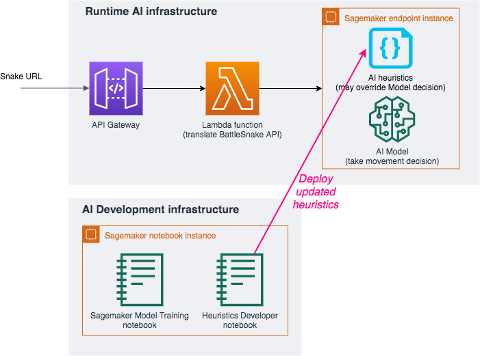

# STEP 2 - Customize the AI heuristics

In [STEP 1 - Deploy the environment](DeployTheAIEndpoint.md) you deployed a snake using a pre-trained deep learning model. However, deep learning models can sometimes choose sub-optimal actions which can result in undesirable outcomes for your snake, such as colliding with a wall or facing off with an opponent snake that has a longer body (in both cases, your snake will die).

So in this section, you will write some heuristics that serve as ground rules for your snake. These ground rules will override any decisions made by the deep learning model. For example, you can write a routine that will determine if a given movement decision will result in a collision with a wall, or if your snake can be able to defeat another shorter snake by colliding with it, head to head.

In the next section, you will you "deeper" and customize your deep learning model [STEP 3](TrainModelAndDeploy.md).

Let's begin!

> __PRE-REQUISITE__: You need to run __[STEP 1 - Deploy the environment](DeployTheAIEndpoint.md)__ before completing STEP 2 or STEP 3.

---
_If you do clever things, your pull request is welcome!_

## Architecture

> __Estimated cost__ : This environment does not add any cost to the [STEP 1 environment](DeployTheAIEndpoint.md). The free tiers include 250 hours per month of this notebook instance during the first two months.
> After the free tiers, the charge will be $0.269 per hour for the notebook instance ($6.5 per 24 hour period).
> __Cost savings tip__ : Once you have finished working, you can stop your notebook instance in order to stop consuming free tiers or incurring charges. You can easily restart them at a later date to continue with your work.

## How to develop your own heuristic algorithms

### Open and load the heuristic dev environment

From the Cloudformation stack created during [STEP 1](DeployTheAIEndpoint.md), go to the 'Outputs' tab and click on the link next to _HeuristicsDevEnvironment_:

> _You need to be authenticated for that link to work. Click on __SourceEditionInNotebook__ link if you are denied access_

Now that you have the notebook `HeuristicDeveloper.ipynb` open, ensure that you have a functioning model (if you have altered the model, you may need to configure the inference step in `heuristics_utils.get_action(*args)`). Press ► at the top of the Jupyter window to run the notebook (_see [here](https://www.youtube.com/watch?v=7wfPqAyYADY) for a tutorial on how to use Jupyter notebooks_).

### Open the heuristic source code

From the Cloudformation stack created during [STEP 1](DeployTheAIEndpoint.md), go to the 'Outputs' tab and click on the link next to _SourceEditionInNotebook_:

Then navigate to `battlesnake/LocalEnv/battlesnake_inference/battlesnake_heuristics.py`

You can customize the `run()` method in the class `MyBattlesnakeHeuristics` with your own rules (see `go_to_food_if_close` for an example). 

> __Dev tools:__ Editing code in Jupyter notebooks with no source version control is convenient for testing purposes,  but isn't practical for larger projects. If you are interested in implementing source code version control, see: [setup source control](SetupSourceControl.md)

## Visualising your algorithm

- If you want to visualize your AI in action, ensure that you are using *Jupyter* instead of *JupyterLab* (this is the default if you use the links from the CloudFormation 'Outputs' tab).
- The notebook loads a pre-trained model and allows your AI to interact with the environment
- After the *Playback the simulation* section, you should see the step-by-step positions, actions, health etc. of each snake.
- If you want to specify the positions of each snake and food (instead of randomly generating it), you can enter it in `initial_state` in *Define the openAI gym*. initial_state is defined similarly to the [battlesnake API](https://docs.battlesnake.com/snake-api).

## Deploy your own custom snake

- If you trained a new model (but did not deploy it yet), run the cell in *(Optional) Run if you retrained the model*
- Otherwise, simply run the cell in *Deploy your new heuristics* and your snake will be deployed.
- Note that there's no need to change the url on the battlesnake engine.

## Next step: customize the Model

Go to __[STEP 3 - Train the AI model with your own settings](TrainModelAndDeploy.md)__ to train the model again with your own settings.
